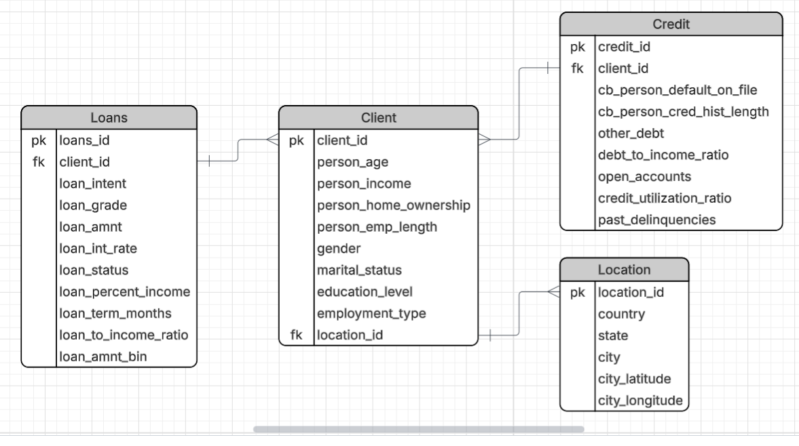
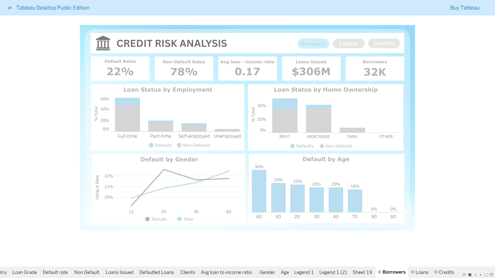
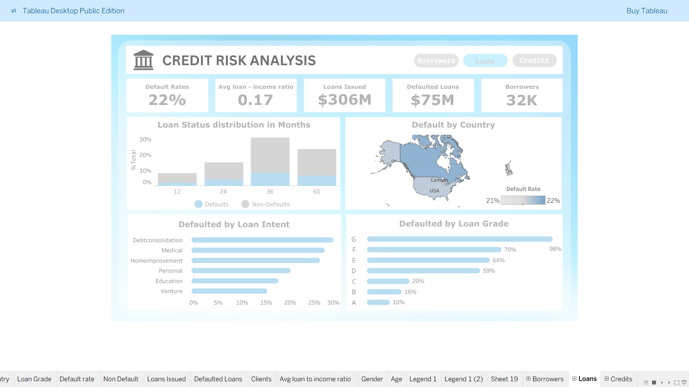
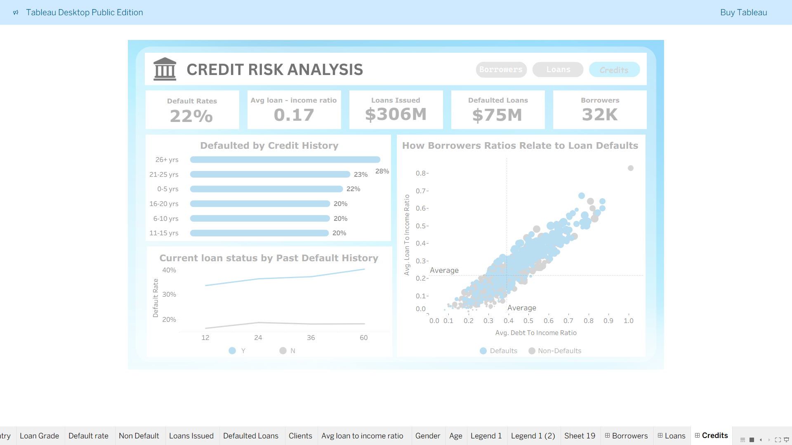

# Nova Bank Credit Risk Analysis

Nova Bank is a financial institution based in the USA, UK, and Canada. 
The company provides loans for personal, medical, education, and business purposes. Its mission is to make lending accessible to more people while ensuring that risks are managed effectively.

---

## Objective:
At Nova Bank, the challenge is to approve enough loans to serve more customers while avoiding losses from high-risk borrowers. 
As a credit risk analyst, the task is to study borrower data to understand who defaults, why they default, and how lending decisions can be improved.

---

## Dataset Structure

---

## Executive Summary – Credit Risk Analysis

This dashboard provides an overview of borrower behavior and loan performance.

### Key Insights:
-	**Default Rate:** 22% of borrowers failed to repay their loans, while 78% successfully repaid.
-	**Loan-to-Income Ratio:** On average, borrowers used 17% of their income for loan repayment.
-	**Total Loans Issued:** $306 million across approximately 32,000 borrowers.

### Employment and Home Ownership:
- Full-time employees are the most reliable in repayment.  
- Unemployed borrowers show the highest risk.  
- Borrowers who own homes are generally safer compared to those renting.

### Demographics:
-	Default rates are similar between men and women, with women showing slightly lower risk.
-	Younger borrowers (in their 20s) have higher default rates.
-	Older borrowers (60–70 years) are more reliable. Very old age groups (80+) have minimal defaults due to fewer loans taken.

## Conclusion
Most borrowers repay their loans, but risk is concentrated among the unemployed, renters, and younger borrowers. Safer lending segments include full-time employees, homeowners, and older borrowers.

## Dashboard Preview  

---

## DEEP INSIGHTS

### Loan Status Distribution (by Loan Term):
-	Defaults rise steadily during the first three years, with year 3 (36 months) showing the highest defaults and non-defaults.
- In year 4 (60 months), defaults drop from around 10% to 5%, showing longer terms may be slightly safer.

### Loan Intent and Loan Grade:
-	Loans taken for Education, Venture, and Personal reasons are safer, with default rates below 20%.
-	Debt Consolidation, Medical, and Home Improvement loans show higher risk, with default rates above 25%.
-	Grade G loans carry the highest risk.
-	Grades D, E, and F fall into a medium-risk range.
-	Grades A, B, and C are generally safer, with much lower default rates.

### Country Defaults:
-	Borrowers in the USA, UK, and Canada all have default rates between 21%–22%.
-	This suggests that geography is not a major factor in loan defaults.

## Conclusion
Overall, loan risk is strongly linked to loan purpose, loan grade, and repayment term length. Safer groups are those borrowing for education or personal reasons, or with higher credit grades (A–C). Riskier groups include borrowers with medical or debt consolidation loans and those with low credit grades (G). Country of residence shows little to no impact on default risk.

## Dashboard Preview  

### Credit History:
-	Borrowers with a credit history of 6–10 years, 11–15 years, and 16–20 years all show default rates of around 20%.
-	Those with 0–5 years of history have slightly higher defaults at 22%, while 21–25 years sits at 23%.
-	Borrowers with 26+ years of history have the highest defaults at 28%, showing that very long credit histories are not always safer.

### Borrowers Who Previously Defaulted
-	Borrowers who had defaulted before show a rising trend, with defaults climbing from around 30% to over 40%.
-	Borrowers with no past defaults stay much lower, with rates below 20% over time.

### Borrower Ratios and Loan Defaults
-	In the upper-right area (high loan-to-income and debt-to-income ratios), there are more defaults, and the larger circles indicate bigger loan amounts at higher risk.
-	In the lower-left area (lower ratios), loans are smaller and defaults are fewer.

## Conclusion
Credit history alone does not guarantee safety—while mid-range histories (6–20 years) have stable default rates around 20%, very short or very long histories carry higher risk. Past defaults are a strong warning sign, as those borrowers show much higher chances of defaulting again. Finally, borrowers taking larger loans with higher loan-to-income and debt-to-income ratios are more likely to default, making these ratios key factors to monitor.

## Dashboard Preview  

---

## Recommendations
- Review high-risk loan grades: Loans in Grade G, and to a lesser extent D–F, show higher default rates and may require stricter approval checks.
-	Pay closer attention to loan purpose: Debt consolidation, medical, and home improvement loans carry higher default risk and could benefit from tighter evaluation.
-	Monitor borrowers with past defaults: Applicants with a history of default are more likely to default again and may need additional risk controls.
-	Use ratios as key indicators: Higher loan-to-income and debt-to-income ratios strongly link to defaults. These should be factored heavily into risk scoring.
-	Track loan term behavior: Defaults rise in shorter-to-medium terms (up to 36 months) but drop in longer terms. This trend may help in setting repayment structures.

---

## Technologies Used  

- [Python – Data Cleaning](./Credit%20Analysis.ipynb)
- [MySQL – Dataset Normalization](./Credit_Risk_Normalization.sql)
- [Live Dashboard](https://public.tableau.com/app/profile/george.mwaura/viz/CreditRiskAnalysis_17590651443340/Loans)
